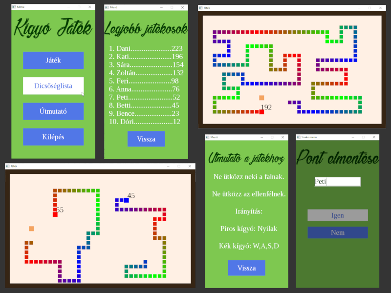

# CSnake

This was one of my earliest project, made for my semester 1 homework.

## Description

A simple snake game implemented with C language and SDL2 for the UI. The game can be played up to 2 players and has a persistent leaderboard for stroring scores. The game language is hungarian.
